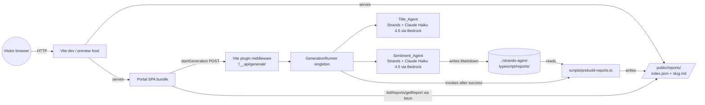
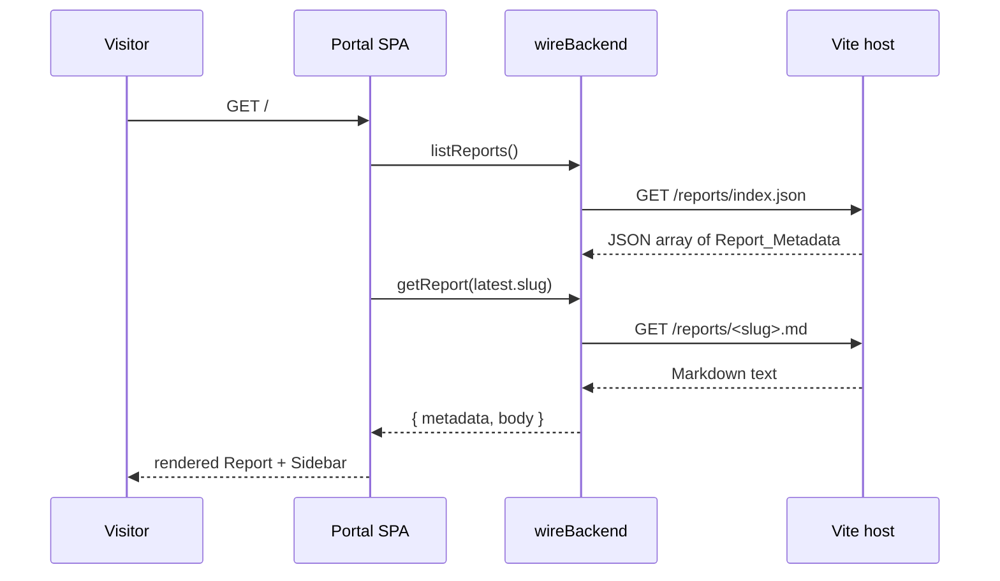
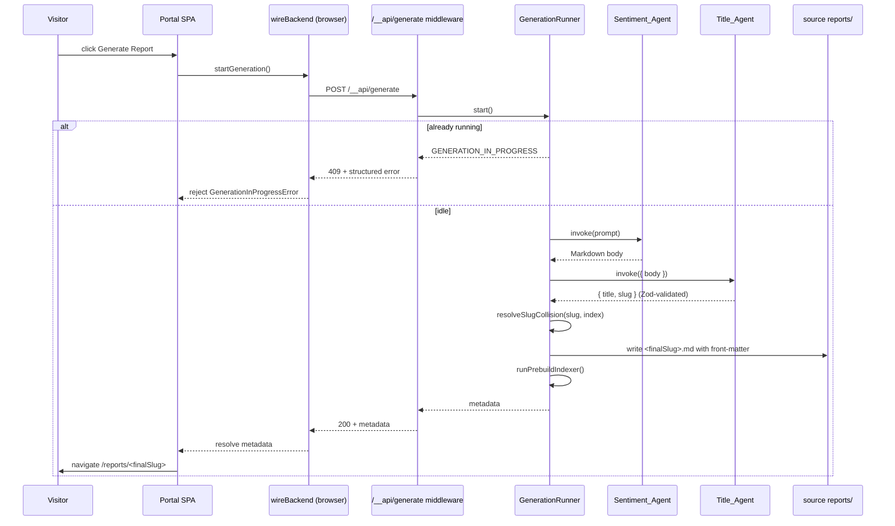
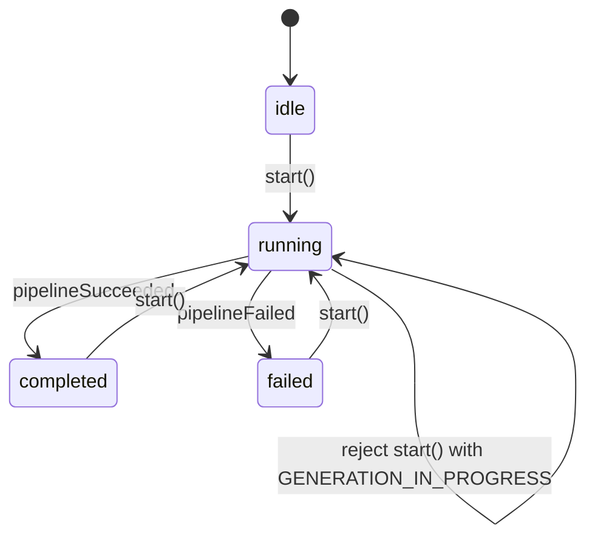

# Design Document

## Overview

The Hacker News Portal is a React + Vite + TypeScript web frontend, isolated in a new top-level `hacker-news-portal/` folder, that surfaces Hacker News sentiment reports produced by the existing Strands-based `strands-agent-typescript/` project. The Portal reads reports as **static assets** served by Vite (`/reports/index.json` and `/reports/<slug>.md`), which a Node.js **Prebuild Script** materializes from the authoritative `strands-agent-typescript/reports/` folder before every dev server start and every production build.

Visitors land on the most recent report, browse the archive through an accessible sidebar, and navigate between reports with slug-based URLs. A `Generate Report` button triggers a **Generation Run**: the existing `Sentiment_Agent` produces the report body, a new `Title_Agent` (Claude Haiku 4.5 on Amazon Bedrock) proposes a short `{ title, slug }` pair, the Portal validates the pair with Zod, resolves any slug collision, persists the report into the source `reports/` folder, re-runs the indexer, and navigates to the new report.

The Portal talks to a single **`wireBackend` module** whose public TypeScript interface matches the shape a future production backend will expose. In Phase 2 that interface is satisfied by:

1. A browser-side implementation that fetches `index.json` and Markdown files over HTTP (the static path).
2. A thin Vite dev-server middleware (`/__api/generate`) that hosts the Generation Run state machine in the Node.js process where the Strands agents can actually run.

This split keeps the "frontend-only slice" single-command (`npm run dev`) while respecting that the Strands SDK requires a Node runtime and AWS credentials, and leaves the Portal UI insulated from every future backend swap.

### Design Goals

- **Isolation** (Req 14): the Portal never imports from `strands-agent-typescript/src/` and only reads `strands-agent-typescript/reports/` at prebuild time; it owns its own `package.json`, `tsconfig.json`, `node_modules/`, and build output.
- **Static-first reads** (Req 9, 13, 15): runtime reads are pure static HTTP fetches so the 500 ms warm-cache budget is trivially satisfiable.
- **Backend-shaped interface** (Req 12): the UI depends only on the `wireBackend` types, not on the in-process implementation.
- **Safe Markdown** (Req 10): an explicit deny list plus sanitization run before HTML is inserted into the DOM; a renderer exception falls back to raw text plus a user-visible banner.
- **Deterministic naming** (Req 4, 11): slug format, collision suffix, and fallback title derivation are pure functions with stable outputs for identical inputs.
- **Strict TypeScript** (Req 17): `strict`, `noImplicitAny`, `noUnusedLocals`, `noUnusedParameters`; no `any` in `src/`; `tsc -b` runs before `vite build`.

### Key Research Findings

- **react-markdown + remark-gfm + rehype-sanitize** is the canonical safe Markdown stack for React. `rehype-sanitize` accepts a schema derived from GitHub's defaults; the Req 10 deny list is enforced by starting from that schema and subtracting the listed tags and any attribute starting with `on`. See [react-markdown README](https://github.com/remarkjs/react-markdown) and [hast-util-sanitize](https://github.com/syntax-tree/hast-util-sanitize).
- **rehype-highlight** wraps `highlight.js` and works inside the react-markdown rehype plugin chain, which lets Req 10.3 and Req 10.4 fall out naturally (recognized language → highlighted, missing/unknown → plain code block).
- **gray-matter** parses YAML front-matter with a strict mode option; combined with a narrow Zod schema the prebuild script can reject malformed files with clear paths.
- **Vite plugin middleware** (`server.middlewares.use`) is the supported way to expose a Node-side HTTP endpoint during dev and `vite preview`, which is where the Strands agents will run in Phase 2.

## Architecture

### System Context



### High-level Slices

1. **Portal SPA (browser)**: React Router routes `/` and `/reports/:slug`, a `Layout` component composed of `Sidebar` + `Main`, a `MarkdownRenderer`, and a `GenerateReportButton`. All I/O goes through the `wireBackend` module.
2. **`wireBackend` module (browser)**: public interface + static-HTTP implementation for reads, and an HTTP client for generation that targets `/__api/generate`.
3. **Vite generation plugin (Node, dev and preview only)**: exposes `/__api/generate` (POST start, GET status) and owns the `GenerationRunner` singleton; invokes the Strands agents; persists reports; re-runs the indexer.
4. **Prebuild Script (Node)**: materializes `public/reports/index.json` plus per-slug copied Markdown files; fails loudly on malformed inputs.

### Runtime Request Flows

Read flow (landing page):



Generation flow:



### Repository Layout

```
hackernews-sentiment-analyzer/
├── strands-agent-typescript/        # untouched, read-only for reports/
│   └── reports/
│       └── hn-sentiment-*.md
├── hacker-news-portal/              # NEW, this spec
│   ├── package.json                 # own dependencies + scripts
│   ├── tsconfig.json                # strict; no external extends
│   ├── tsconfig.node.json           # for the prebuild and plugin code
│   ├── vite.config.ts
│   ├── index.html
│   ├── public/
│   │   └── reports/                 # generated by prebuild; gitignored
│   │       ├── index.json
│   │       └── <slug>.md
│   ├── scripts/
│   │   └── prebuild-reports.ts      # Node-side indexer
│   ├── plugins/
│   │   └── generation-plugin.ts     # Vite plugin: /__api/generate
│   ├── src/
│   │   ├── main.tsx
│   │   ├── app/
│   │   │   ├── App.tsx
│   │   │   ├── routes.tsx
│   │   │   └── layout/
│   │   │       ├── Layout.tsx
│   │   │       ├── Sidebar.tsx
│   │   │       └── Main.tsx
│   │   ├── features/
│   │   │   ├── reports/
│   │   │   │   ├── ReportView.tsx
│   │   │   │   ├── NotFoundView.tsx
│   │   │   │   └── EmptyArchiveView.tsx
│   │   │   └── generate/
│   │   │       ├── GenerateReportButton.tsx
│   │   │       └── GenerationStatus.tsx
│   │   ├── markdown/
│   │   │   ├── MarkdownRenderer.tsx
│   │   │   ├── sanitizeSchema.ts
│   │   │   └── highlight.ts
│   │   ├── wireBackend/
│   │   │   ├── index.ts             # re-exports public types + factory
│   │   │   ├── types.ts             # public interface & error types
│   │   │   ├── staticBackend.ts     # browser implementation (Phase 2)
│   │   │   └── generationClient.ts  # HTTP client for /__api/generate
│   │   ├── domain/
│   │   │   ├── reportMetadata.ts    # pure helpers (fallback title, sort)
│   │   │   ├── slug.ts              # slug regex + collision resolver
│   │   │   └── frontMatter.ts       # parse / serialize pure helpers
│   │   ├── generation/              # Node-only (imported by plugin)
│   │   │   ├── GenerationRunner.ts
│   │   │   ├── titleAgent.ts
│   │   │   └── persistReport.ts
│   │   └── styles/
│   │       └── tokens.css
│   └── .gitignore                   # ignores node_modules, dist, public/reports/
```

`scripts/` and `plugins/` and `src/generation/` are the only Node-runtime TS sources; everything in `src/` other than `src/generation/` must be browser-safe.

### Module Dependency Rules

- `app/` → `features/` → `domain/`, `markdown/`, `wireBackend/`.
- `wireBackend/` → `domain/` (pure helpers). `wireBackend/` never imports from `generation/` in browser code; only the HTTP client knows about the generation endpoint.
- `generation/` (Node only) → `domain/` + Strands SDK. `generation/` is imported by `plugins/generation-plugin.ts`, not by any browser entrypoint. `tsconfig.json` restricts which folders ship to the browser bundle; the Vite plugin uses a separate `tsconfig.node.json` project reference.
- `domain/` is pure and framework-free so it is safe for both browser and Node and is the primary home for property-tested logic.

## Components and Interfaces

### 1. Prebuild Script — `scripts/prebuild-reports.ts`

Responsibilities:

- Resolve the absolute path to `../strands-agent-typescript/reports/` relative to `hacker-news-portal/`.
- Enumerate only top-level `.md` files (no recursion) in that folder.
- For each file: read UTF-8, parse with `gray-matter` (strict YAML), validate with a Zod schema (`ReportFrontMatter`).
- Detect duplicate `slug` values across all valid files.
- Write `public/reports/index.json` (sorted per §Data Models) and copy each valid file to `public/reports/<slug>.md` with only the body content preserved (front-matter retained intact so the Markdown renderer receives exactly the persisted body — the Prebuild does not strip front-matter to keep read back-compatibility simple; the `MarkdownRenderer` hides any leading front-matter block).
- Fail loudly per the rules below.

Exit rules (Req 9.5, 13.6, 13.7, 13.8):

| Condition                                                                | Action                                                                           |
| ------------------------------------------------------------------------ | -------------------------------------------------------------------------------- |
| YAML front-matter block missing                                          | non-zero exit, log file path                                                     |
| YAML unparseable                                                         | non-zero exit, log file path and parser error                                    |
| `id`, `slug`, `generatedAt`, `title`, or `prompt` missing                | non-zero exit, log file path and list of missing fields                          |
| `generatedAt` not a valid ISO-8601 UTC timestamp                         | non-zero exit, log file path                                                     |
| Duplicate `slug` across two or more files                                | non-zero exit, log every colliding file path, do not emit index or copy any file |
| `slug` not matching `^[a-z0-9]+(?:-[a-z0-9]+)*$` or length out of [1,80] | non-zero exit, log file path                                                     |
| Any `fs` write error                                                     | non-zero exit, partial files removed                                             |

CLI contract: `tsx scripts/prebuild-reports.ts` prints a one-line summary (`Indexed N report(s)`) on success, emits all errors to stderr, exits with 0 on success and ≠0 on failure. `package.json` wires:

```json
"scripts": {
  "prebuild-reports": "tsx scripts/prebuild-reports.ts",
  "predev":  "npm run prebuild-reports",
  "prebuild": "npm run prebuild-reports",
  "dev":   "vite",
  "build": "tsc -b && vite build",
  "preview": "vite preview"
}
```

Because `predev`/`prebuild` precede Vite, the indexer must complete before the dev server or the build runs (Req 13.4, 13.5).

### 2. Vite Generation Plugin — `plugins/generation-plugin.ts`

A Vite plugin object with `configureServer(server)` and `configurePreviewServer(server)` hooks that register a middleware at `/__api/generate`:

- `POST /__api/generate` → body is ignored; calls `GenerationRunner.start()`.
  - 200 + `{ metadata: ReportMetadata }` on success.
  - 409 + `{ error: { code: "GENERATION_IN_PROGRESS" } }` when already running.
  - 500 + `{ error: { code, stage, message } }` on failure (Req 7.1).
- `GET  /__api/generate` → returns `{ status: GenerationStatus }` for optional polling.

The plugin holds a single `GenerationRunner` instance captured in the plugin closure; it is shared across all HTTP requests in the Node process, which is the necessary surface for Req 6. In production builds the plugin is not bundled; the browser-side `wireBackend` therefore receives a `503 DATA_SOURCE_UNAVAILABLE` from any request to `/__api/generate`, which the UI treats the same as any other generation failure.

### 3. GenerationRunner — `src/generation/GenerationRunner.ts`

A singleton state machine with states `idle`, `running`, `completed`, `failed`. Transitions:



Stored fields: `status`, `runId` (UUID), `startedAt`, `stage`, `lastError`. Transitions are guarded by an internal mutex so concurrent `start()` calls observe `running` deterministically.

Pipeline stages (each stage name is surfaced verbatim in failure records, Req 7.1):

1. `sentiment` — invoke `createHackerNewsSentimentAgent()` and extract report body text.
2. `title` — invoke `createTitleAgent()` with the report body; receive raw SDK output.
3. `titleValidation` — parse with `TitleAgentOutputSchema` (Zod); collect ZodError issues.
4. `slugResolution` — resolve slug collisions against the current `Report_Index`.
5. `persist` — write `<finalSlug>.md` to `../strands-agent-typescript/reports/` using `writeFile` with `{ flag: "wx" }` to avoid overwriting existing files; clean up partial writes on failure (Req 8.6).
6. `reindex` — invoke the Prebuild Script (as a library function) to refresh `public/reports/`.

After `reindex` succeeds, `GenerationRunner` resolves with the new `ReportMetadata`. On any stage failure it transitions to `failed`, records the stage and error, **does not** write or mutate `index.json`, and rejects (Req 7.2).

### 4. Title Agent — `src/generation/titleAgent.ts`

A new Strands agent built on the Strands Agents TypeScript SDK, using the Claude Haiku 4.5 Bedrock global cross-region inference profile (same model id already used by `strands-agent-typescript/src/agent.ts`: `global.anthropic.claude-haiku-4-5-20251001-v1:0`). The agent has no tools; it is invoked with a system prompt instructing it to return a JSON object `{ "title": string, "slug": string }` with the `slug` rules encoded in natural language. The returned text is parsed as JSON and then validated with:

```ts
const TitleAgentOutputSchema = z.object({
  title: z.string().min(1).max(80),
  slug: z
    .string()
    .min(1)
    .max(48)
    .regex(/^[a-z0-9]+(?:-[a-z0-9]+)*$/),
});
```

Any parse/validation failure surfaces as a `titleValidation` failure (Req 11.2, 11.5).

### 5. Slug Collision Resolver — `src/domain/slug.ts`

Pure functions:

```ts
export const SLUG_REGEX = /^[a-z0-9]+(?:-[a-z0-9]+)*$/;
export function isValidSlug(value: string): value is Slug {
  /* regex + length */
}

export type Slug = string & { readonly __brand: "Slug" };

/**
 * Resolve a slug collision by appending the smallest suffix -2..-999 that
 * produces a slug not in `existing`. Returns `null` if every suffix is taken.
 * The returned slug always satisfies SLUG_REGEX.
 */
export function resolveSlugCollision(
  base: Slug,
  existing: ReadonlySet<string>,
): Slug | null;
```

This matches Req 11.6 and 11.7 exactly and is a pure function, so it becomes a property-test target.

### 6. `wireBackend` Public Interface — `src/wireBackend/types.ts`

```ts
export interface ReportMetadata {
  readonly id: string;
  readonly title: string; // may be "" — Portal applies fallback title logic
  readonly slug: string;
  readonly generatedAt: string; // ISO-8601 UTC, trailing Z
  readonly prompt: string;
}

export interface ReportPayload {
  readonly metadata: ReportMetadata;
  readonly body: string; // raw Markdown (front-matter stripped for display)
}

export type BackendErrorCode =
  | "NOT_FOUND"
  | "DATA_SOURCE_UNAVAILABLE"
  | "GENERATION_IN_PROGRESS"
  | "GENERATION_FAILED";

export interface BackendError extends Error {
  readonly code: BackendErrorCode;
  readonly stage?: GenerationStage; // present iff code is GENERATION_FAILED
}

export interface BackendInterface {
  listReports(): Promise<ReadonlyArray<ReportMetadata>>;
  getReport(slug: string): Promise<ReportPayload>;
  startGeneration(): Promise<ReportMetadata>;
}

export type GenerationStage =
  | "sentiment"
  | "title"
  | "titleValidation"
  | "slugResolution"
  | "persist"
  | "reindex";
```

`BackendError` is constructed with factory functions (`notFound(slug)`, `dataSourceUnavailable(cause)`, `generationInProgress()`, `generationFailed(stage, cause)`). Every rejection from the `wireBackend` implementation is one of those four codes (discriminated union in callers), satisfying Req 12.6, 12.7, 12.8 and Req 6.

### 7. `wireBackend` Static Implementation — `src/wireBackend/staticBackend.ts`

Phase 2 implementation:

- `listReports()` — `fetch("/reports/index.json")`, `response.json()`, validate against `z.array(ReportMetadataSchema)`. Validation failures → `DATA_SOURCE_UNAVAILABLE`. Preserves order from the file (Req 12.2).
- `getReport(slug)` — first call `listReports()` to confirm the slug exists. If not present → `NOT_FOUND`. Otherwise `fetch("/reports/" + encodeURIComponent(slug) + ".md")`, text, strip leading YAML front-matter block with a shared helper, return `{ metadata, body }`.
- `startGeneration()` — POST to `/__api/generate`; map HTTP status → `BackendError`:
  - 200 → resolve with parsed `metadata`.
  - 409 → reject `GENERATION_IN_PROGRESS`.
  - 503 / network error → reject `DATA_SOURCE_UNAVAILABLE`.
  - Other → reject `GENERATION_FAILED` with `stage` from body if provided.

After a successful `startGeneration()` the SPA triggers a `listReports()` re-fetch (cache-busted with a query string) so the Sidebar picks up the new entry before navigating (Req 5.4, 9.3).

### 8. App Shell and Routing

- React Router v6 with two route definitions:
  - `"/"` → `LandingRoute` → reads index, redirects internally to the latest report's `ReportView` while keeping the URL at `/` (Req 1.1).
  - `"/reports/:slug"` → `ReportView` → renders the Report corresponding to `:slug`.
  - Catch-all `*` → `NotFoundView` (Req 3.4).
- `Layout` places `<Sidebar />` and `<main>` side by side. Both are always rendered (Req 1.5, 3.4, 6.4).
- `Sidebar` is `<nav aria-label="Report archive">` containing a `<ul>` of `<li><a href="/reports/{slug}" aria-current={isActive ? "page" : undefined}>…</a></li>` entries, which gives:
  - Keyboard accessibility via native anchors (Tab focusable, Enter activates, routing intercepts the click to avoid full reload — Req 3.1, 3.2, 16.2).
  - `aria-current="page"` on the matching entry (Req 3.5, 16.3).
  - Back/forward preserved by the browser history stack (Req 3.6).
- `GenerateReportButton` is a `<button type="button">` rendered in the `Layout` header so it appears on `/` and `/reports/:slug` (Req 5.1). It is a single controlled component with local UI state: `idle | pending | progress-visible | error`. It calls `backend.startGeneration()` and navigates on success.
- `GenerationStatus` renders the progress indicator. The indicator is shown with `role="status"` and an accessible name (`aria-label="Generating report"`), guaranteed visible within 200 ms via an optimistic render before the request is awaited (Req 5.3). It shares a module-scoped React context so any `GENERATION_IN_PROGRESS` error received in another tab or a rapid second click triggers the same banner (Req 6.3, 6.4).

### 9. Markdown Renderer — `src/markdown/MarkdownRenderer.tsx`

Pipeline (Req 10):

```ts
<ReactMarkdown
  remarkPlugins={[remarkGfm]}
  rehypePlugins={[
    [rehypeSanitize, sanitizeSchema],
    rehypeHighlight,
  ]}
/>
```

`sanitizeSchema` starts from `defaultSchema` (hast-util-sanitize) and:

- **Removes** `script`, `style`, `iframe`, `object`, `embed`, `link`, `meta`, `form` from `tagNames`.
- Adds a schema-wide `allowedAttributesFilter` that drops any attribute whose name starts with `on`.
- Allows `className` on `code`/`pre` so `rehype-highlight` can attach its language classes.

`rehype-highlight` is configured with `{ ignoreMissing: true, plainText: [] }` so that:

- Recognized language identifiers produce highlighted output (Req 10.3).
- Missing/unknown language identifiers leave the code block as plain monospaced text with preserved line structure (Req 10.4).

The component is wrapped in a React `ErrorBoundary`: on any render-time exception it falls back to a `<pre>` displaying the raw Markdown body plus a visible "Could not render this report" banner (Req 1.3). The renderer is lazy-loaded via `React.lazy` so it does not block the landing route's initial critical path (supports Req 15).

### 10. Fallback Title Helper — `src/domain/reportMetadata.ts`

```ts
export function displayTitle(
  meta: ReportMetadata,
  siblings: ReadonlyArray<ReportMetadata>,
): string {
  const hasTitle = meta.title.trim().length > 0;
  const hasGeneratedAt = meta.generatedAt.length > 0;
  if (hasTitle) return meta.title;
  if (!hasGeneratedAt && meta.slug.length > 0)
    return `HN Sentiment — ${meta.slug}`;
  if (!hasGeneratedAt) return `HN Sentiment`;
  const collidingSiblings = siblings.filter(
    (s) =>
      s.id !== meta.id &&
      s.title.trim().length === 0 &&
      s.generatedAt === meta.generatedAt,
  );
  if (collidingSiblings.length > 0) {
    return `HN Sentiment — ${meta.generatedAt} (${meta.slug})`;
  }
  return `HN Sentiment — ${meta.generatedAt}`;
}
```

This single pure function covers Req 4.1, 4.2, 4.3, and 4.4 in one place so the Sidebar and the rendered Report view always agree (Req 4.2 byte-identical guarantee).

### 11. Index Ordering Helper — `src/domain/reportMetadata.ts`

```ts
export function sortReportsForDisplay(
  metas: ReadonlyArray<ReportMetadata>,
): ReadonlyArray<ReportMetadata> {
  return [...metas].sort((a, b) => {
    if (a.generatedAt !== b.generatedAt) {
      return a.generatedAt < b.generatedAt ? 1 : -1; // ISO-8601 string compare, reverse-chronological
    }
    const slugCompare = a.slug
      .toLowerCase()
      .localeCompare(b.slug.toLowerCase());
    return slugCompare;
  });
}
```

The prebuild script and the Sidebar both use this function, so index ordering invariants (Req 2.2, 2.3, 9.2) are enforced in exactly one place.

### 12. Error and Empty States

| Condition                                             | Surface                                                                                    | Requirement       |
| ----------------------------------------------------- | ------------------------------------------------------------------------------------------ | ----------------- |
| `Report_Index` empty                                  | Main view shows "No reports available yet" empty-state; Sidebar shows matching placeholder | Req 1.4, 2.5      |
| `Report_Index` fetch / parse fails                    | Sidebar shows "Archive unavailable" with Retry button; Main view shows a banner            | Req 2.6, 9.4      |
| Report Markdown fetch fails                           | Main view shows "Report could not be loaded"; Sidebar unchanged                            | Req 1.5           |
| Markdown render throws                                | Fallback to raw `<pre>` + banner                                                           | Req 1.3           |
| Route slug not in index                               | `NotFoundView` in Main; Sidebar still rendered                                             | Req 3.4           |
| `startGeneration()` rejected `GENERATION_IN_PROGRESS` | Persistent banner "A generation is already running"                                        | Req 6.3, 6.4      |
| `startGeneration()` rejected `GENERATION_FAILED`      | Persistent banner with stage + message; button re-enabled                                  | Req 5.6, 7.3, 7.4 |

## Data Models

### Report YAML Front-Matter (authoritative)

Every report written to `../strands-agent-typescript/reports/` carries this block as its first content, delimited by two `---` lines (Req 8.2):

```yaml
---
id: "01J8X7…" # non-empty, unique across reports/
title: "Front-page mood: mixed optimism" # non-empty string, ≤ 80 chars
slug: "front-page-mood-mixed-optimism" # matches SLUG_REGEX, 1..80 chars
generatedAt: "2026-05-07T20:16:39Z" # ISO-8601 UTC, trailing Z
prompt: "Analyze the top 5 Hacker News front page stories." # non-empty
---
```

`id` is a ULID generated by the Sentiment Agent persistence layer (sortable, collision-resistant). The `generatedAt` is second-precision with a mandatory `Z` suffix (Req 8.3).

### `ReportFrontMatterSchema` (Zod)

```ts
export const IsoUtcTimestamp = z
  .string()
  .regex(/^\d{4}-\d{2}-\d{2}T\d{2}:\d{2}:\d{2}(\.\d+)?Z$/);

export const SlugString = z.string().min(1).max(80).regex(SLUG_REGEX);

export const ReportFrontMatterSchema = z.object({
  id: z.string().min(1),
  title: z.string(), // allows "", Portal derives fallback
  slug: SlugString,
  generatedAt: IsoUtcTimestamp,
  prompt: z.string().min(1),
});
export type ReportFrontMatter = z.infer<typeof ReportFrontMatterSchema>;
```

The schema is used by both the prebuild script and `wireBackend.listReports()` validation so front-matter is defined in exactly one place.

### `Report_Index` — `public/reports/index.json`

A JSON array of `ReportMetadata`, sorted by `sortReportsForDisplay` (reverse-chronological by `generatedAt`, secondary ascending case-insensitive by `slug`). No wrapping object; the Portal reads the array directly:

```json
[
  {
    "id": "01J8X7…",
    "title": "Front-page mood: mixed optimism",
    "slug": "front-page-mood-mixed-optimism",
    "generatedAt": "2026-05-07T20:16:39Z",
    "prompt": "Analyze the top 5 Hacker News front page stories."
  }
]
```

### Generation Run State

```ts
export interface GenerationStateBase {
  readonly runId: string;
  readonly startedAt: string; // ISO-8601 UTC
}
export type GenerationState =
  | { readonly status: "idle" }
  | ({
      readonly status: "running";
      readonly stage: GenerationStage;
    } & GenerationStateBase)
  | ({
      readonly status: "completed";
      readonly metadata: ReportMetadata;
    } & GenerationStateBase)
  | ({
      readonly status: "failed";
      readonly stage: GenerationStage;
      readonly message: string;
    } & GenerationStateBase);
```

This discriminated union drives the `GET /__api/generate` response payload and the Portal's internal progress indicator.

### URL Shape

- `/` — landing; renders the latest report in Main.
- `/reports/:slug` — a specific report; `:slug` MUST match `SLUG_REGEX`.
- Any other path — `NotFoundView`.

### Performance Budgets

| Path                                            | Budget              | Strategy                                                                                                                            |
| ----------------------------------------------- | ------------------- | ----------------------------------------------------------------------------------------------------------------------------------- |
| First render of `/` on warm cache               | ≤ 500 ms (Req 15.1) | Code-split `MarkdownRenderer`; prefetch `index.json` on SPA boot; eagerly fetch `<latest.slug>.md` in parallel with React hydration |
| Route change to `/reports/:slug` on warm cache  | ≤ 500 ms (Req 15.2) | Cache `index.json` in a singleton promise; cache Markdown bodies in a `Map<slug, string>` with LRU eviction at 50 entries           |
| Progress indicator visible after Generate click | ≤ 200 ms (Req 5.3)  | Optimistic UI: set `pending` state synchronously in the click handler before awaiting the fetch                                     |
| `GENERATION_IN_PROGRESS` banner after rejection | ≤ 500 ms (Req 6.3)  | Error rendering is driven by a synchronous `setState`; the 500 ms slack covers network round-trip                                   |

### Security Model

- No secrets ship to the browser: Bedrock credentials are read by the Node-side Vite plugin from `process.env` (`AWS_REGION`, standard AWS credential chain); the browser only sees the `/__api/generate` HTTP contract (Behaviors §3).
- The Markdown sanitization schema is the only trust boundary between Markdown files on disk and the DOM; raw HTML in report content is escaped as visible text (Req 10.2).
- Prebuild never copies files whose front-matter fails validation, so malformed reports cannot reach the browser.

## Correctness Properties

_A property is a characteristic or behavior that should hold true across all valid executions of a system — essentially, a formal statement about what the system should do. Properties serve as the bridge between human-readable specifications and machine-verifiable correctness guarantees._

Property-based testing is appropriate for this feature because the pure domain logic (sorting, slug validation and collision resolution, fallback title derivation, front-matter round-tripping, sanitization) has large input spaces where 100+ iterations meaningfully exercise edge cases. UI wiring details that do not vary with input (button presence, navigation hops, specific error banners) are listed in the Testing Strategy as example-based tests instead.

### Property 1: Report ordering and landing selection

_For any_ array of Report_Metadata, the result of `sortReportsForDisplay` is in reverse-chronological order by `generatedAt`, ties are broken by ascending case-insensitive `slug`, and the first element (or `null` if the array is empty) is the Portal's landing-view Report.

**Validates: Requirements 1.1, 2.2, 2.3, 9.2**

### Property 2: Sidebar composition and hrefs

_For any_ non-empty array of Report_Metadata, the rendered Sidebar contains exactly one `<a>` element per entry, preserves the order produced by Property 1, and each anchor's `href` attribute equals `/reports/{slug}` for its Report.

**Validates: Requirements 2.1, 3.1, 16.2**

### Property 3: Sidebar date format

_For any_ Sidebar entry whose Report has a valid ISO-8601 UTC `generatedAt`, the displayed date string matches `/^\d{4}-\d{2}-\d{2}$/` and equals the first ten characters of the Report's `generatedAt` value.

**Validates: Requirements 2.4**

### Property 4: Active-entry aria-current

_For any_ pair `(Report_Index, activeSlug)`, exactly one Sidebar entry carries `aria-current="page"` when `activeSlug` matches an entry's `slug`; otherwise no Sidebar entry carries `aria-current`.

**Validates: Requirements 3.5, 16.3**

### Property 5: Route resolution

_For any_ `(Report_Index, requestedSlug)`, the Portal renders `ReportView(requestedSlug)` if `requestedSlug` is the `slug` of some entry in `Report_Index`, and `NotFoundView` otherwise; in both branches the Sidebar is rendered.

**Validates: Requirements 3.3, 3.4**

### Property 6: Fallback title derivation

_For any_ Report_Metadata `meta` and any array of sibling Report_Metadata `siblings`, the value returned by `displayTitle(meta, siblings)` satisfies:

- `meta.title` when `meta.title.trim()` is non-empty;
- `HN Sentiment — {meta.slug}` when `meta.title` is empty and `meta.generatedAt` is empty;
- `HN Sentiment — {meta.generatedAt} ({meta.slug})` when `meta.title` is empty, `meta.generatedAt` is present, and at least one other sibling has an empty title and the same `meta.generatedAt`;
- `HN Sentiment — {meta.generatedAt}` otherwise;
  and `displayTitle` is pure (identical inputs always yield the identical string).

**Validates: Requirements 4.1, 4.2, 4.3, 4.4**

### Property 7: Sidebar navigability during generation

_For any_ `Report_Index` and any `GenerationState` (`idle`, `running`, `completed`, `failed`), every Sidebar entry renders as an interactive anchor with a correct `href`, so existing Reports remain navigable while a Generation_Run is pending, in progress, or has failed.

**Validates: Requirements 5.5**

### Property 8: GenerationRunner concurrency

_For any_ concurrent sequence of `GenerationRunner.start()` invocations, at most one invocation observes the state transitioning from non-running to `running`; every other overlapping invocation rejects with a `BackendError` whose `code` is `GENERATION_IN_PROGRESS`, and the in-progress run's `runId`, `startedAt`, and `stage` are unchanged across the rejection.

**Validates: Requirements 6.1, 6.2, 12.8**

### Property 9: Failure safety

_For any_ Generation_Run that fails at any stage (`sentiment`, `title`, `titleValidation`, `slugResolution`, `persist`, `reindex`), the set of persisted Report files and the contents of `public/reports/index.json` after the run are byte-identical to their pre-run state, and the pipeline emits exactly one structured failure record containing the run's `runId`, the failing stage name, and the underlying error message.

**Validates: Requirements 7.1, 7.2, 8.6, 11.5**

### Property 10: Front-matter serialize/parse round-trip

_For any_ `ReportFrontMatter` value that satisfies `ReportFrontMatterSchema`, the composition `parseFrontMatter(serializeFrontMatter(v))` is deep-equal to `v`, and the serialized form begins with `---\n`, ends the front-matter block with `\n---\n`, and produces non-empty values for every schema field.

**Validates: Requirements 8.2, 9.1**

### Property 11: ISO-8601 UTC formatter

_For any_ `Date` value, `formatGeneratedAt(date)` matches the regular expression `/^\d{4}-\d{2}-\d{2}T\d{2}:\d{2}:\d{2}(\.\d+)?Z$/` and `new Date(formatGeneratedAt(date)).getTime() === date.getTime()`.

**Validates: Requirements 8.3**

### Property 12: Unique id generator

_For any_ positive integer `n` up to 10 000, generating `n` Report ids in sequence produces `n` pairwise-distinct strings.

**Validates: Requirements 8.5**

### Property 13: Indexer filtering and exit rules

_For any_ set of front-matter blobs placed in a simulated source folder, the prebuild indexer (a) emits exactly one `Report_Index` entry per blob whose YAML parses and whose front-matter satisfies `ReportFrontMatterSchema`, (b) logs a line identifying every rejected file, and (c) exits with a non-zero status if and only if at least one blob is rejected.

**Validates: Requirements 9.1, 9.5, 13.1, 13.6, 13.7**

### Property 14: Indexer duplicate-slug safety

_For any_ set of valid front-matter blobs in which two or more blobs share the same `slug`, the prebuild indexer exits with a non-zero status, writes no `public/reports/index.json` file, copies no Markdown file into `public/reports/`, and emits the path of every colliding input file.

**Validates: Requirements 13.8**

### Property 15: Indexer file-copy byte-equality

_For any_ valid input Markdown file with front-matter slug `S`, after the prebuild indexer completes successfully there exists a file at `public/reports/S.md` whose byte contents are identical to the source file's byte contents.

**Validates: Requirements 13.3**

### Property 16: Markdown sanitization deny list

_For any_ Markdown input string, the DOM produced by `MarkdownRenderer` contains no element whose tag name is in `{script, style, iframe, object, embed, link, meta, form}`, contains no attribute whose name begins with `on`, and contains no executed raw HTML that was present in the input.

**Validates: Requirements 10.2**

### Property 17: Title_Agent output schema correctness

_For any_ candidate object `c`, `TitleAgentOutputSchema.safeParse(c)` returns success if and only if `c.title` is a string with `1 ≤ c.title.length ≤ 80`, `c.slug` is a string with `1 ≤ c.slug.length ≤ 48`, and `c.slug` matches `^[a-z0-9]+(?:-[a-z0-9]+)*$`.

**Validates: Requirements 11.1, 11.2, 11.3, 11.4**

### Property 18: Slug collision resolution

_For any_ valid base slug `base` and any set `existing` of existing slugs, the result `r = resolveSlugCollision(base, existing)` satisfies:

- if `base ∉ existing`, then `r === base`;
- if `{base, base-2, …, base-999} ⊆ existing`, then `r === null`;
- otherwise `r` matches `SLUG_REGEX`, `r` has the form `base` or `base-N` for some integer `N ∈ [2, 999]`, `r ∉ existing`, and for every integer `M ∈ [2, N)` the slug `base-M ∈ existing`.

**Validates: Requirements 11.6, 11.7**

### Property 19: wireBackend NOT_FOUND behavior

_For any_ `Report_Index` served by `staticBackend` and any slug `s`, `getReport(s)` resolves with a payload whose `metadata.slug === s` if `s` matches an entry in the index, and rejects with a `BackendError` whose `code` is `NOT_FOUND` otherwise; rejection carries no partial content or metadata.

**Validates: Requirements 12.6**

## Error Handling

Every user-visible error surfaces through the same `BackendError` discriminated union (`NOT_FOUND`, `DATA_SOURCE_UNAVAILABLE`, `GENERATION_IN_PROGRESS`, `GENERATION_FAILED`). Error rendering responsibilities:

| Error code                              | Where raised                               | UI surface                                                 | Button state               | Telemetry                                                          |
| --------------------------------------- | ------------------------------------------ | ---------------------------------------------------------- | -------------------------- | ------------------------------------------------------------------ |
| `NOT_FOUND`                             | `staticBackend.getReport` when slug absent | `NotFoundView` in Main; Sidebar retained                   | unchanged                  | warn log with slug                                                 |
| `DATA_SOURCE_UNAVAILABLE` — index       | `staticBackend.listReports`                | Sidebar "Archive unavailable" + Retry; Main banner         | unchanged                  | error log with cause                                               |
| `DATA_SOURCE_UNAVAILABLE` — report body | `staticBackend.getReport`                  | Main "Report could not be loaded" banner; Sidebar retained | unchanged                  | error log with slug                                                |
| `GENERATION_IN_PROGRESS`                | `generationClient.startGeneration`         | Persistent banner "A generation is already running"        | re-enabled after rejection | info log                                                           |
| `GENERATION_FAILED`                     | `generationClient.startGeneration`         | Persistent banner with stage + message                     | re-enabled within 1000 ms  | `console.error` with `{ runId, stage, message }` structured record |

Internal (Node-side) error handling in `GenerationRunner`:

1. Every stage runs inside a `try { ... } catch (err) { transitionToFailed(stage, err); throw toBackendError(stage, err); }` block.
2. The `persist` stage uses `writeFile` with `{ flag: "wx" }` and wraps the write in a cleanup that deletes the partial file on any error (Req 8.6).
3. `transitionToFailed` mutates only the `GenerationRunner` state; it never touches the filesystem or `index.json`, so Property 9 holds by construction.
4. All failure records are logged to `stderr` as a single-line JSON object with `{ level: "error", runId, stage, message, ts }`.

React-side safety nets:

- `MarkdownRenderer` is wrapped in `<ErrorBoundary>`; the boundary stores the thrown error, renders a raw-text fallback with a visible banner, and logs to `console.error` (Req 1.3).
- `ReportView` uses `<Suspense>` around the lazy-loaded renderer so a fetch-in-flight shows a lightweight placeholder rather than an empty main area.
- Route-level error boundaries catch any unhandled throw from a route and render a generic "Something went wrong" screen with a retry that resets the boundary, keeping the Sidebar visible.

The Portal never swallows an error silently: every catch either maps to a `BackendError` or logs structured context before re-rendering.

## Testing Strategy

The workspace steering rule forbids writing unit tests unless the user explicitly asks for them, so this section specifies the **intended** test plan that a later `tasks.md` may formalize on request. It distinguishes PBT targets (the properties above) from example, integration, and smoke tests.

### Test tooling choices

- **Test runner**: Vitest (first-class Vite integration, TS-native, browser-style DOM via `jsdom`).
- **Property-based testing library**: `fast-check` (the idiomatic TypeScript PBT library; supports `fc.assert` with `{ numRuns: 100 }` minimum per property).
- **DOM assertions**: `@testing-library/react` + `@testing-library/user-event` for Example tests that render components.
- **Accessibility**: `axe-core` via `@axe-core/react` for the Req 16.4 contrast/axe integration check.
- **Smoke**: plain Node scripts (`node --test` or Vitest node environment) for config and build-pipeline assertions.

Each property test runs at least 100 iterations (`fc.assert(..., { numRuns: 100 })`) and is tagged with a comment matching the required format:

```ts
// Feature: hackernews-portal, Property 18: For any valid base slug base and any set existing of existing slugs, ...
```

### PBT target modules and what each property asserts

| Property | Module under test                                  | Generator(s)                                                | Oracle                                            |
| -------- | -------------------------------------------------- | ----------------------------------------------------------- | ------------------------------------------------- |
| 1        | `domain/reportMetadata.ts::sortReportsForDisplay`  | `fc.array(reportMetadataArb)`                               | reference sort comparator                         |
| 2        | `app/layout/Sidebar.tsx`                           | `fc.array(reportMetadataArb, {minLength: 1})`               | DOM query: `<a>` per entry, href pattern          |
| 3        | `app/layout/Sidebar.tsx`                           | `reportMetadataArb` with valid `generatedAt`                | regex match + prefix check                        |
| 4        | `app/layout/Sidebar.tsx`                           | `fc.tuple(reportIndexArb, fc.option(slugArb))`              | DOM query for `aria-current`                      |
| 5        | `app/routes.tsx`                                   | `fc.tuple(reportIndexArb, slugArb)`                         | predicate `slug ∈ index` → expected component     |
| 6        | `domain/reportMetadata.ts::displayTitle`           | `fc.record({title, slug, generatedAt, siblings})`           | branch-wise expected string                       |
| 7        | `app/layout/Sidebar.tsx`                           | `fc.tuple(reportIndexArb, generationStateArb)`              | DOM query: every entry is an anchor               |
| 8        | `generation/GenerationRunner.ts`                   | `fc.scheduler()` over `start()` calls                       | at-most-one-running invariant                     |
| 9        | `generation/GenerationRunner.ts`                   | `fc.tuple(preStateArb, failingStageArb)`                    | pre-state FS == post-state FS + single log record |
| 10       | `domain/frontMatter.ts`                            | `reportFrontMatterArb`                                      | `parse∘serialize == id`                           |
| 11       | `generation/persistReport.ts::formatGeneratedAt`   | `fc.date()`                                                 | regex + round-trip                                |
| 12       | `generation/persistReport.ts::newReportId`         | `fc.integer({min: 1, max: 10000})`                          | set-distinctness                                  |
| 13       | `scripts/prebuild-reports.ts`                      | `fc.array(frontMatterBlobArb)`                              | valid-set equality + exit code                    |
| 14       | `scripts/prebuild-reports.ts`                      | `fc.array(duplicateSlugBlobArb, {minLength: 2})`            | abort + no output                                 |
| 15       | `scripts/prebuild-reports.ts`                      | `fc.array(validBlobArb)`                                    | byte-equal copies                                 |
| 16       | `markdown/MarkdownRenderer.tsx`                    | `fc.string()` mixed with disallowed HTML fragments          | DOM deny-list predicate                           |
| 17       | `generation/titleAgent.ts::TitleAgentOutputSchema` | mixed valid/invalid object generator                        | schema oracle                                     |
| 18       | `domain/slug.ts::resolveSlugCollision`             | `fc.tuple(slugArb, fc.subset({base, base-2,...,base-999}))` | three-branch oracle                               |
| 19       | `wireBackend/staticBackend.ts::getReport`          | `fc.tuple(reportIndexArb, slugArb)`                         | `slug ∈ index` predicate                          |

### Example tests (not PBT)

For the UI wiring that does not vary meaningfully with input, example tests exercise:

- Landing view renders the newest report (Req 1.1 concrete flow).
- Markdown pipeline uses remark-gfm, rehype-sanitize, rehype-highlight (Req 1.2, 10.1, 10.3).
- Renderer error-boundary fallback (Req 1.3).
- Report body fetch failure → "Report could not be loaded" banner (Req 1.5).
- Archive fetch failure → "Archive unavailable" + Retry (Req 2.6, 9.4).
- Keyboard activation of Sidebar entries (Req 3.2).
- Direct navigation to `/reports/{slug}` renders Main + Sidebar (Req 3.3).
- Browser back/forward renders the correct route (Req 3.6).
- Generate button presence on `/` and `/reports/:slug` (Req 5.1).
- Generate-click disables button until settled and shows progress within 200 ms (Req 5.2, 5.3).
- Generation success flow navigates and re-enables button (Req 5.4).
- Generation failure flow shows error banner and re-enables button (Req 5.6, 7.3, 7.4).
- `GENERATION_IN_PROGRESS` banner visible within 500 ms (Req 6.3, 6.4).
- `listReports` fetches `/reports/index.json` (Req 9.3).
- `getReport` returns `{ metadata, body }` for a known slug (Req 12.3).
- `DATA_SOURCE_UNAVAILABLE` mapping from network failure (Req 12.7).
- `startGeneration` happy path returns new metadata (Req 12.4).
- GFM table, fenced code, autolink rendering (Req 10.1).
- Unknown language fenced block renders as plain monospaced text (Req 10.4).
- Sidebar is `<nav aria-label="Report archive">` (Req 16.1).

### Integration tests

- **Performance budget** (Req 15.1, 15.2, 15.3): a Playwright or Vitest `happy-dom` harness warms the browser cache by loading `/` once, then measures the Performance API entries for five consecutive navigations and asserts the median `first-contentful-paint → main-visible` timing is ≤ 500 ms. Run against `npm run dev` with the report fixtures in place. Tagged as an integration test, not PBT, because it measures wall-clock performance rather than a pure function.
- **Reduced motion** (Req 16.5): integration test that sets `prefers-reduced-motion: reduce`, navigates, asserts no decorative transitions fire, and asserts the `role="status"` progress indicator still renders during a mocked generation.
- **Accessibility audit** (Req 16.4): run `axe-core` against `/` and `/reports/{slug}` with seeded reports; assert zero violations of `wcag2aa` rules. Manual audit with assistive technology captures remaining WCAG AA items that automated tooling cannot verify.
- **End-to-end generation** (Req 5, 6, 7 smoke): in a controlled environment with AWS credentials available, run a single real `startGeneration` call against the dev server and assert a new report file lands in `../strands-agent-typescript/reports/` and appears at the top of the Sidebar after index refresh. This integration test is gated behind an env flag so unit CI does not make Bedrock calls.

### Smoke checks

- Repository layout: `hacker-news-portal/package.json`, `hacker-news-portal/tsconfig.json`, `hacker-news-portal/vite.config.ts` exist (Req 14.1, 14.2, 14.4, 14.5).
- No imports from `../strands-agent-typescript/src/` in `src/` (Req 14.3).
- `predev` and `prebuild` scripts in `package.json` invoke the indexer (Req 13.4, 13.5).
- `tsconfig.json` sets `strict`, `noImplicitAny`, `noUnusedLocals`, `noUnusedParameters` to `true` and does not extend an external config (Req 14.5, 17.1).
- `grep -RE ": any\\b" src/` returns no matches (Req 17.2).
- `npm run build` runs `tsc -b` before `vite build`; injecting a synthetic type error fails the build (Req 17.3, 17.4).
- `npm install && npm run build` on a clean checkout exits zero and produces `dist/` inside `hacker-news-portal/` (Req 14.6, 14.7).
- `wireBackend` entry module exports `listReports`, `getReport`, `startGeneration`, `BackendError`, and every public type (Req 12.1, 12.5).

### Test configuration constants

- Property-based tests: `{ numRuns: 100, seed: CI_SEED ?? Date.now() }`; property tests always include the tag comment referencing the design property they validate.
- Example tests run under `jsdom` with a deterministic fetch mock.
- Integration tests run under `happy-dom` or Playwright depending on whether they exercise the Vite dev server.
- Test fixtures (seed reports used for perf and integration tests) live at `hacker-news-portal/test-fixtures/reports/` and are copied into `../strands-agent-typescript/reports/` only for the duration of the performance tests.

Scope note: the current scope adds no tests to the implementation tasks. The properties, examples, integrations, and smokes described here are the plan the team may opt into later. The property statements themselves are binding descriptions of correct behavior regardless of whether a test harness exists today.
