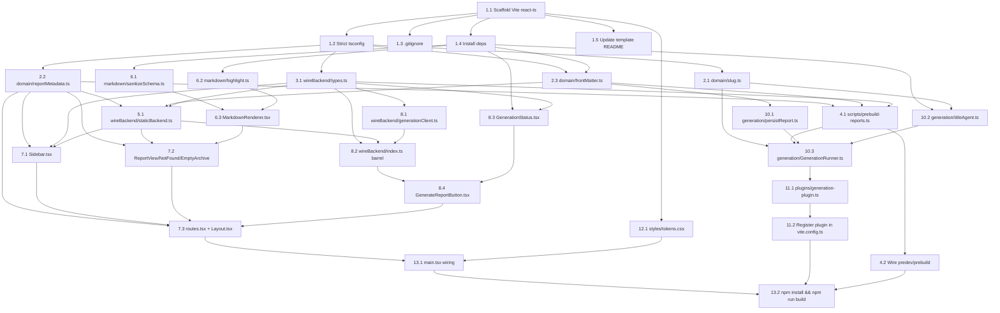

# Implementation Plan: hackernews-portal

## Overview

Build the Hacker News Portal as an isolated `hacker-news-portal/` React + Vite + TypeScript app that reads sentiment reports authored by `strands-agent-typescript/` as static assets (prebuild-materialized into `public/reports/`) and triggers new Generation Runs via a Vite-plugin middleware that hosts a singleton `GenerationRunner` pipeline (`sentiment → title → titleValidation → slugResolution → persist → reindex`). The Portal consumes a single `wireBackend` module whose public TypeScript interface matches the future production backend, and introduces a new Strands Title_Agent on Claude Haiku 4.5 (Amazon Bedrock) for `{ title, slug }` proposal.

The tasks below proceed in a DAG order:

1. Scaffold the isolated project and strict TS config.
2. Build the pure domain helpers (`slug`, `reportMetadata`, `frontMatter`).
3. Define the `wireBackend` public types so the UI and Node sides can both target them.
4. Build the Prebuild Script, the static read backend, and the Markdown renderer in parallel.
5. Wire the App shell, Sidebar, routes, and the browser Generate flow.
6. Checkpoint: the browser slice must type-check and build with empty `public/reports/`.
7. Build the Node-side generation pipeline (`persistReport`, `titleAgent`, `GenerationRunner`), the Vite generation plugin, and design tokens.
8. Wire `main.tsx` and verify a clean `npm install && npm run build`.

No test-writing tasks are included. The design's Testing Strategy documents a planned PBT + example-test plan that is out of scope for this tasks.md.

## Tasks

- [x] 1. Scaffold the isolated `hacker-news-portal/` project
  - [x] 1.1 Scaffold the Vite React+TypeScript project
    - Create a new folder `hacker-news-portal/` at the repository root, sibling to `strands-agent-typescript/` and `vanilla-agent-python/`.
    - Scaffold from the standard Vite `react-ts` template so `package.json`, `tsconfig.json`, `tsconfig.app.json`, `tsconfig.node.json`, `vite.config.ts`, `index.html`, the template `README.md`, `src/main.tsx`, and `src/App.tsx` are generated inside `hacker-news-portal/`.
    - Do not create any other files in this step; later tasks own each subsystem.
    - _Requirements: 14.1, 14.2, 14.4, 14.5, 14.6_
    - _Design: Architecture → Repository Layout_
    - _Depends on: —_

  - [x] 1.2 Enable strict TypeScript compiler options
    - In `hacker-news-portal/tsconfig.app.json` and `hacker-news-portal/tsconfig.node.json`, set `strict`, `noImplicitAny`, `noUnusedLocals`, `noUnusedParameters` all to `true`.
    - In `hacker-news-portal/tsconfig.json`, keep the project references (`tsconfig.app.json` + `tsconfig.node.json`) and ensure no `extends` path points outside `hacker-news-portal/`.
    - Add `"references"` entries so the Node-side `scripts/` and `plugins/` compile under `tsconfig.node.json` while `src/` compiles under `tsconfig.app.json`.
    - Change the `build` script in `package.json` to `tsc -b && vite build` so type-check precedes bundling.
    - _Requirements: 14.5, 17.1, 17.3, 17.4_
    - _Design: Design Goals → Strict TypeScript; Architecture → Module Dependency Rules_
    - _Depends on: 1.1_

  - [x] 1.3 Add the Portal-local `.gitignore`
    - Create `hacker-news-portal/.gitignore` that ignores `node_modules/`, `dist/`, and `public/reports/` so prebuild output and build output are never committed.
    - _Requirements: 13.2, 14.6_
    - _Design: Architecture → Repository Layout (`.gitignore`)_
    - _Depends on: 1.1_

  - [x] 1.4 Declare and install the Portal dependencies
    - Edit `hacker-news-portal/package.json` to add runtime deps: `react`, `react-dom`, `react-router-dom`, `react-markdown`, `remark-gfm`, `rehype-sanitize`, `rehype-highlight`, `zod`.
    - Add dev/runtime deps needed by Node-side code: `tsx`, `gray-matter`, the Strands Agents TypeScript SDK (`@strands-agents/sdk`), `@aws-sdk/client-bedrock-runtime`, `@types/node`.
    - Keep the template-scaffolded dev deps: `typescript`, `vite`, `@vitejs/plugin-react`, `@types/react`, `@types/react-dom`.
    - Run `npm install` inside `hacker-news-portal/` to produce a `package-lock.json`.
    - No secrets or credentials are added; Bedrock will read from the AWS credential chain at runtime.
    - _Requirements: 10.1, 10.2, 10.3, 10.4, 11.1, 11.2, 13.1, 14.4, 14.6_
    - _Design: Components §1 (gray-matter, zod), §4 (Title Agent on Claude Haiku 4.5), §9 (react-markdown stack); Security Model_
    - _Depends on: 1.1_

  - [x] 1.5 Update the scaffolded template README with Portal scripts
    - Edit the existing `hacker-news-portal/README.md` (the one produced by the Vite template) to describe `npm run dev`, `npm run build`, `npm run preview`, and the `prebuild-reports` prerequisite that materializes `public/reports/` from `../strands-agent-typescript/reports/`.
    - Do not create any additional Markdown files; only edit this template-scaffolded README.
    - _Requirements: 13.4, 13.5, 14.7_
    - _Design: Components §1 (CLI contract and npm scripts table)_
    - _Depends on: 1.1_

- [x] 2. Implement the pure domain helpers in `src/domain/`
  - [x] 2.1 Implement `src/domain/slug.ts`
    - Export `SLUG_REGEX = /^[a-z0-9]+(?:-[a-z0-9]+)*$/`, a branded `Slug = string & { readonly __brand: "Slug" }` type, and `isValidSlug(value: string): value is Slug` enforcing the regex plus `1 ≤ length ≤ 80`.
    - Export `resolveSlugCollision(base: Slug, existing: ReadonlySet<string>): Slug | null` returning `base` when `base ∉ existing`, otherwise appending the smallest suffix in `-2…-999` that is not in `existing`, otherwise `null`.
    - The module is pure, has no I/O, and is importable by both browser and Node code.
    - _Requirements: 11.3, 11.4, 11.6, 11.7_
    - _Design: Components §5 Slug Collision Resolver; realizes Properties 17 (slug regex predicate) and 18 (collision resolution)_
    - _Depends on: 1.2_

  - [x] 2.2 Implement `src/domain/reportMetadata.ts`
    - Export `sortReportsForDisplay(metas)` that returns a copy sorted reverse-chronologically by `generatedAt` as ISO-8601 string compare, with ties broken by ascending case-insensitive `slug`.
    - Export `displayTitle(meta, siblings)` implementing the four-branch fallback from §Components 10 exactly (title present; both empty with slug; tie on `generatedAt` with empty title; otherwise `HN Sentiment — {generatedAt}`).
    - Both functions are pure and side-effect-free so the Sidebar and the Report view always agree byte-identically.
    - _Requirements: 2.2, 2.3, 4.1, 4.2, 4.3, 4.4, 9.2_
    - _Design: Components §10 Fallback Title Helper, §11 Index Ordering Helper; realizes Properties 1 (ordering) and 6 (fallback title)_
    - _Depends on: 1.2_

  - [x] 2.3 Implement `src/domain/frontMatter.ts`
    - Export `ReportFrontMatterSchema` (Zod) as defined in §Data Models — `id`, `title` (may be empty), `slug` via `SlugString`, `generatedAt` via `IsoUtcTimestamp` regex `/^\d{4}-\d{2}-\d{2}T\d{2}:\d{2}:\d{2}(\.\d+)?Z$/`, `prompt`.
    - Export `parseFrontMatter(source: string)` (using `gray-matter` in strict mode) that returns `{ data: ReportFrontMatter, body: string }` and `serializeFrontMatter(v: ReportFrontMatter, body: string)` that produces a block starting with `---\n` and ending the block with `\n---\n` so the round-trip `parse ∘ serialize` is the identity.
    - Export `formatGeneratedAt(date: Date): string` returning an ISO-8601 UTC timestamp that matches the regex and round-trips via `new Date(...).getTime()`.
    - Export `stripFrontMatter(body: string): string` used by the renderer and static backend.
    - _Requirements: 8.2, 8.3, 9.1_
    - _Design: Components §1 (front-matter validation), Data Models → Report YAML Front-Matter and `ReportFrontMatterSchema`; realizes Properties 10 (round-trip) and 11 (ISO-8601 formatter)_
    - _Depends on: 1.2, 1.4_

- [x] 3. Define the `wireBackend` public interface
  - [x] 3.1 Implement `src/wireBackend/types.ts`
    - Export the types from §Components 6: `ReportMetadata`, `ReportPayload`, `BackendErrorCode`, `BackendError`, `BackendInterface`, `GenerationStage`, and the `GenerationState` discriminated union.
    - Export a `ReportMetadataSchema` Zod schema that matches `ReportFrontMatterSchema`'s shape (reused by `listReports`).
    - Export factory functions `notFound(slug)`, `dataSourceUnavailable(cause)`, `generationInProgress()`, `generationFailed(stage, cause)` that construct `BackendError` instances (subclass `Error`) preserving the original `cause` and setting the correct `code` and (for `GENERATION_FAILED`) `stage`.
    - This is the only file the UI depends on for error-handling types, per Req 12.5.
    - _Requirements: 7.1, 12.1, 12.5, 12.6, 12.7, 12.8_
    - _Design: Components §6 wireBackend Public Interface; Error Handling table_
    - _Depends on: 1.2_

- [x] 4. Implement the Prebuild Script and wire it into npm scripts
  - [x] 4.1 Implement `scripts/prebuild-reports.ts`
    - Resolve `../strands-agent-typescript/reports/` relative to `hacker-news-portal/` using `import.meta.url`.
    - Enumerate top-level `.md` files only (no recursion); read each as UTF-8.
    - For every file: parse YAML front-matter via `parseFrontMatter` (strict), validate with `ReportFrontMatterSchema`, then detect duplicate `slug` values across all files before writing anything.
    - On success, sort the valid set via `sortReportsForDisplay`, write `public/reports/index.json`, and copy each source `.md` byte-identically to `public/reports/<slug>.md` (front-matter retained so the renderer strips it at display time).
    - Implement every failure rule from the §Components 1 exit-rules table: missing block, unparseable YAML, missing required field, invalid `generatedAt`, duplicate slug, invalid slug, write errors → non-zero exit with stderr log of offending file path(s). Partial files from a failed write are removed before exit.
    - Emit a one-line success summary `Indexed N report(s)` on success.
    - Export a reusable `runPrebuildIndexer(): Promise<void>` library function alongside the CLI entry so `GenerationRunner.reindex` can invoke it in-process without a child process.
    - _Requirements: 9.1, 9.3, 9.5, 13.1, 13.2, 13.3, 13.6, 13.7, 13.8_
    - _Design: Components §1 Prebuild Script; realizes Properties 13 (filtering + exit rules), 14 (duplicate-slug safety), 15 (byte-equality copy)_
    - _Depends on: 2.2, 2.3, 3.1_

  - [x] 4.2 Wire `predev` and `prebuild` npm scripts
    - Edit `hacker-news-portal/package.json` scripts to add: `"prebuild-reports": "tsx scripts/prebuild-reports.ts"`, `"predev": "npm run prebuild-reports"`, `"prebuild": "npm run prebuild-reports"`, and keep `"dev": "vite"`, `"build": "tsc -b && vite build"`, `"preview": "vite preview"`.
    - This guarantees the indexer completes before the dev server serves requests and before the production bundle emits.
    - _Requirements: 13.4, 13.5_
    - _Design: Components §1 (npm scripts)_
    - _Depends on: 4.1_

- [x] 5. Implement the static-read `wireBackend` backend
  - [x] 5.1 Implement `src/wireBackend/staticBackend.ts`
    - `listReports()`: `fetch("/reports/index.json")`, `.json()`, validate with `z.array(ReportMetadataSchema)`; on any parse/network failure reject with `dataSourceUnavailable(cause)`; on success return the array in its on-disk order (already sorted by the Prebuild).
    - `getReport(slug)`: call `listReports()` first, reject with `notFound(slug)` if absent; otherwise `fetch("/reports/" + encodeURIComponent(slug) + ".md")`, read text, strip the leading front-matter block via `stripFrontMatter`, and return `{ metadata, body }`.
    - Cache `index.json` in a module-scoped singleton promise (with a cache-busting query param helper exposed for post-generation refresh) and cache Markdown bodies in a `Map<slug, string>` with LRU eviction at 50 entries, to satisfy the 500 ms warm-cache budget.
    - Never import from `src/generation/` or any Node-only module.
    - _Requirements: 1.5, 9.3, 9.4, 12.2, 12.3, 12.6, 12.7, 15.1, 15.2, 15.3_
    - _Design: Components §7 wireBackend Static Implementation; realizes Property 19 (NOT_FOUND behavior)_
    - _Depends on: 3.1, 2.2, 2.3_

- [x] 6. Implement the Markdown rendering pipeline
  - [x] 6.1 Implement `src/markdown/sanitizeSchema.ts`
    - Build `sanitizeSchema` starting from `defaultSchema` of `hast-util-sanitize`.
    - Remove `script`, `style`, `iframe`, `object`, `embed`, `link`, `meta`, `form` from `tagNames`.
    - Drop every attribute whose name begins with `on` via a schema-wide filter (regardless of tag).
    - Keep `className` allowed on `code` and `pre` so `rehype-highlight`'s language classes survive.
    - _Requirements: 10.2_
    - _Design: Components §9 Markdown Renderer; realizes Property 16 (sanitization deny list)_
    - _Depends on: 1.4_

  - [x] 6.2 Implement `src/markdown/highlight.ts`
    - Configure and re-export `rehype-highlight` with `{ ignoreMissing: true, plainText: [] }` so unrecognized language identifiers fall back to plain monospaced text and recognized languages are highlighted.
    - _Requirements: 10.3, 10.4_
    - _Design: Components §9 (rehype-highlight configuration)_
    - _Depends on: 1.4_

  - [x] 6.3 Implement `src/markdown/MarkdownRenderer.tsx`
    - Render `<ReactMarkdown remarkPlugins={[remarkGfm]} rehypePlugins={[[rehypeSanitize, sanitizeSchema], rehypeHighlight]}>` with the `children` being the report body (front-matter already stripped by caller).
    - Wrap the renderer in a React `ErrorBoundary` that, on any render-time throw, falls back to `<pre>{rawMarkdown}</pre>` plus a visible "Could not render this report" banner and logs the error via `console.error`.
    - Export a `React.lazy`-loaded wrapper component so the renderer is code-split off the landing critical path and `<Suspense>` consumers render a lightweight placeholder while it loads.
    - Never inject raw HTML into the DOM outside the sanitized pipeline.
    - _Requirements: 1.2, 1.3, 10.1, 10.2, 10.3, 10.4, 15.1_
    - _Design: Components §9 Markdown Renderer; Error Handling → React-side safety nets_
    - _Depends on: 6.1, 6.2_

- [x] 7. Implement the App shell, Sidebar, routes, and layout
  - [x] 7.1 Implement `src/app/layout/Sidebar.tsx`
    - Root element: `<nav aria-label="Report archive">` containing a single `<ul>` with one `<li>` per `ReportMetadata`.
    - Render each entry as a React Router `NavLink` to `/reports/{slug}` that sets `aria-current="page"` while the route matches (keyboard focusable, Enter/Space activate the anchor, browser Back/Forward preserved by React Router history).
    - For the label of each entry, use `displayTitle(meta, siblings)`; render the date as the first ten characters of `generatedAt` (`YYYY-MM-DD`).
    - Render the "No reports available" placeholder when the index is empty and an "Archive unavailable" state plus a Retry button when `listReports()` rejected with `DATA_SOURCE_UNAVAILABLE`.
    - Keep every entry interactive regardless of the current `GenerationState` so Sidebar navigation works during a pending, failed, or completed Generation Run.
    - _Requirements: 2.1, 2.2, 2.3, 2.4, 2.5, 2.6, 3.1, 3.2, 3.5, 3.6, 4.2, 5.5, 9.4, 16.1, 16.2, 16.3_
    - _Design: Components §8 App Shell and Routing; realizes Properties 2 (composition), 3 (date format), 4 (aria-current), 7 (navigability during generation)_
    - _Depends on: 2.2, 5.1, 3.1_

  - [x] 7.2 Implement `src/features/reports/*` views
    - `ReportView.tsx` reads the `:slug` route param, calls `backend.getReport(slug)`, renders the body inside `<Suspense>` around the lazy `MarkdownRenderer`, and displays the report title (via `displayTitle`) and the `generatedAt` timestamp in the main view.
    - Map `NOT_FOUND` → render `NotFoundView`; map `DATA_SOURCE_UNAVAILABLE` on the body fetch → render "Report could not be loaded" banner while the Sidebar stays rendered.
    - `NotFoundView.tsx`: main-view not-found message that always renders alongside the Sidebar (Req 3.4).
    - `EmptyArchiveView.tsx`: "No reports available yet" empty-state for the root route when the index has zero entries (Req 1.4).
    - _Requirements: 1.1, 1.4, 1.5, 3.3, 3.4_
    - _Design: Components §8, §12 Error and Empty States; realizes Property 5 (route resolution)_
    - _Depends on: 6.3, 5.1, 2.2_

  - [x] 7.3 Implement `src/app/routes.tsx` and `src/app/layout/Layout.tsx`
    - Define React Router v6 routes:
      - `"/"` → landing route that reads the index, selects the first entry of `sortReportsForDisplay`, and renders `ReportView` with that slug while keeping the URL at `/`.
      - `"/reports/:slug"` → `ReportView`.
      - `"*"` → `NotFoundView`.
    - `Layout.tsx` composes `<Sidebar />` beside `<main>` on every route and hosts the `GenerateReportButton` in its header so the button is visible on both `/` and `/reports/:slug`.
    - Wrap each route in an error boundary that renders a generic "Something went wrong" screen with Retry while keeping the Sidebar rendered.
    - _Requirements: 1.1, 3.3, 3.4, 3.6, 5.1_
    - _Design: Components §8 App Shell and Routing; realizes Properties 1 (landing selection) and 5 (route resolution)_
    - _Depends on: 7.1, 7.2, 8.4, 2.2_

- [x] 8. Implement the browser-side Generate Report flow
  - [x] 8.1 Implement `src/wireBackend/generationClient.ts`
    - Export `startGeneration(): Promise<ReportMetadata>` that POSTs to `/__api/generate` with no body.
    - Map HTTP status → `BackendError`: `200` → resolve with parsed `metadata`; `409` → reject `generationInProgress()`; `503` or a network error → reject `dataSourceUnavailable(cause)`; other non-2xx → reject `generationFailed(stage, cause)` using the `{ code, stage, message }` body when provided.
    - After a `200` response, expose a cache-busting hook that Sidebar/ReportView consumers call to refetch `/reports/index.json?v=<runId>` so the new entry appears before navigation.
    - Never swallow errors; every non-2xx path resolves to one of the four `BackendErrorCode` values.
    - _Requirements: 5.4, 5.6, 6.1, 6.3, 7.1, 7.3, 9.3, 12.4, 12.8_
    - _Design: Components §7 (POST /\_\_api/generate status mapping); §2 Vite Plugin (status codes)_
    - _Depends on: 3.1_

  - [x] 8.2 Implement `src/wireBackend/index.ts`
    - Barrel-export the public types and factories (from `types.ts`), the static-read implementation (`listReports`, `getReport` from `staticBackend.ts`), and `startGeneration` (from `generationClient.ts`) so the rest of the Portal imports only from `wireBackend` per Req 12.1.
    - Expose a single `createWireBackend()` factory that returns an object satisfying `BackendInterface` for future swappability.
    - _Requirements: 12.1, 12.5_
    - _Design: Architecture → Module Dependency Rules; Components §6 (public interface entry module)_
    - _Depends on: 5.1, 8.1, 3.1_

  - [x] 8.3 Implement `src/features/generate/GenerationStatus.tsx`
    - Render the progress indicator as an element with `role="status"` and `aria-label="Generating report"` so screen readers announce it; render textual "Generating report…" content so the status remains informative when motion is suppressed.
    - Provide a module-scoped React context that `GenerateReportButton` and any future caller can write into so a `GENERATION_IN_PROGRESS` banner surfaces even when it is raised outside the button's local state (Req 6.3, 6.4).
    - Honor `prefers-reduced-motion: reduce` by swapping the decorative spinner for a static indicator while keeping the functional `role="status"` element visible (Req 16.5).
    - _Requirements: 5.3, 6.3, 6.4, 16.5_
    - _Design: Components §8 (progress indicator + shared context); Error Handling table_
    - _Depends on: 3.1, 1.4_

  - [x] 8.4 Implement `src/features/generate/GenerateReportButton.tsx`
    - Render `<button type="button">Generate Report</button>` with a local state machine `idle | pending | progress-visible | error`.
    - Click handler synchronously transitions to `pending`, disables the button, and shows `GenerationStatus` via the shared context before awaiting `backend.startGeneration()` so the indicator appears within the 200 ms budget (Req 5.3).
    - On success: re-enable the button, trigger the index cache-busting refetch, then navigate via `useNavigate()` to `/reports/<newSlug>` (Req 5.4, 9.3).
    - On `GENERATION_IN_PROGRESS`: render the persistent "A generation is already running" banner through the shared context and re-enable the button (Req 6.3, 6.4).
    - On `GENERATION_FAILED` or any other error: render the persistent stage+message banner and re-enable the button within 1000 ms (Req 5.6, 7.3, 7.4).
    - Never block Sidebar interaction while pending, completed, or failed (Req 5.5).
    - _Requirements: 5.1, 5.2, 5.3, 5.4, 5.5, 5.6, 6.3, 6.4, 7.3, 7.4_
    - _Design: Components §8 (GenerateReportButton local state machine and progress-visible timing)_
    - _Depends on: 8.2, 8.3_

- [x] 9. Checkpoint — browser slice compiles end-to-end
  - Run `npm run build` inside `hacker-news-portal/`.
  - Expect: `prebuild-reports` succeeds (currently with zero or the existing seed report), `tsc -b` reports zero errors and zero warnings, `vite build` produces `hacker-news-portal/dist/`.
  - Ensure all checks pass, ask the user if questions arise.

- [x] 10. Implement the Node-side generation pipeline in `src/generation/`
  - [x] 10.1 Implement `src/generation/persistReport.ts`
    - Export `newReportId(): string` that produces a ULID-style sortable, collision-resistant id (seeded by timestamp + 80 bits of randomness) so that any sequence of 10,000 calls yields 10,000 pairwise-distinct strings.
    - Export `formatGeneratedAt(date: Date): string` satisfying the ISO-8601 UTC regex and round-trip.
    - Export `persistReport({ id, title, slug, generatedAt, prompt, body })` that serializes the front-matter via `serializeFrontMatter`, writes `../strands-agent-typescript/reports/<slug>.md` with `writeFile(path, contents, { flag: "wx" })`, and wraps the write in a cleanup that `unlink`s the partial file on any error.
    - Never mutate any file outside `../strands-agent-typescript/reports/`.
    - _Requirements: 8.1, 8.2, 8.3, 8.5, 8.6_
    - _Design: Components §3 (persist stage), §10–11, Data Models; realizes Properties 10 (round-trip), 11 (ISO-8601), 12 (unique id)_
    - _Depends on: 2.3_

  - [x] 10.2 Implement `src/generation/titleAgent.ts`
    - Implement `createTitleAgent()` using the Strands Agents TypeScript SDK, configured for the Claude Haiku 4.5 Bedrock global cross-region inference profile `global.anthropic.claude-haiku-4-5-20251001-v1:0`, with no tools.
    - The system prompt instructs the agent to return a single JSON object `{ "title": string, "slug": string }` encoding the slug rules (lowercase ASCII, digits, single-hyphen separators, 1–48 chars, no leading/trailing/consecutive hyphens).
    - Export `TitleAgentOutputSchema` (Zod): `title` 1..80, `slug` 1..48 and matching `SLUG_REGEX`.
    - Export `invokeTitleAgent(body: string): Promise<{ title: string; slug: string }>` that calls the agent, parses the raw output as JSON, validates with `TitleAgentOutputSchema`, and throws on any parse or validation failure (the runner maps it to `titleValidation` failure).
    - Credentials must resolve from the AWS credential chain (`AWS_REGION`, standard profile chain); never read or log secret values.
    - _Requirements: 11.1, 11.2, 11.3, 11.4, 11.5_
    - _Design: Components §4 Title Agent; Security Model; realizes Property 17 (schema correctness)_
    - _Depends on: 1.4, 2.1_

  - [x] 10.3 Implement `src/generation/GenerationRunner.ts`
    - Implement a singleton with states `idle | running | completed | failed`, internal mutex, and fields `runId` (from `newReportId()`), `startedAt` (`formatGeneratedAt(new Date())`), `stage`, `lastError`.
    - `start()` rejects with `generationInProgress()` while `running`; otherwise transitions to `running` and sequences the six stages: `sentiment`, `title`, `titleValidation`, `slugResolution`, `persist`, `reindex`.
    - `sentiment`: invoke the existing Sentiment Agent by importing `createHackerNewsSentimentAgent()` (or the equivalent entry) from `../../strands-agent-typescript/src/agent.ts` read-only; do not modify any file under `strands-agent-typescript/src/`.
    - `title`: call `invokeTitleAgent(body)`.
    - `titleValidation`: parse/validate — any Zod failure is reported with every ZodError issue.
    - `slugResolution`: read the current `Report_Index` via the same in-process Prebuild helper, build a `ReadonlySet<string>` of existing slugs, and call `resolveSlugCollision(proposedSlug, existing)`; a `null` result is a `slugResolution` failure.
    - `persist`: call `persistReport(...)` with the resolved slug; partial files are removed on any write error.
    - `reindex`: invoke `runPrebuildIndexer()` to refresh `public/reports/`.
    - On any stage failure, transition to `failed`, record `{ runId, stage, message }`, emit a single-line JSON record `{ level: "error", runId, stage, message, ts }` to stderr, and reject with `generationFailed(stage, cause)`. `index.json` and previously persisted reports MUST remain byte-identical on failure (Req 7.2).
    - _Requirements: 5.4, 6.1, 6.2, 7.1, 7.2, 8.6, 11.5, 11.6, 11.7, 12.4, 12.8, 14.3_
    - _Design: Components §3 GenerationRunner; Error Handling → internal (Node-side); realizes Properties 8 (concurrency) and 9 (failure safety)_
    - _Depends on: 2.1, 10.1, 10.2, 4.1_

- [x] 11. Implement the Vite generation plugin and register it
  - [x] 11.1 Implement `plugins/generation-plugin.ts`
    - Export a Vite plugin object with `configureServer(server)` and `configurePreviewServer(server)` hooks that register a single middleware at `/__api/generate`.
    - Hold the singleton `GenerationRunner` instance inside the plugin closure so it is shared across all HTTP requests in the Node process (Req 6.1).
    - `POST /__api/generate`: call `runner.start()`; on resolve → `200` + `{ metadata }`; on `GENERATION_IN_PROGRESS` → `409` + `{ error: { code: "GENERATION_IN_PROGRESS" } }`; on other failure → `500` + `{ error: { code, stage, message } }` (Req 7.1).
    - `GET /__api/generate`: return `{ status: GenerationState }` as a JSON payload for optional polling.
    - The plugin only activates in dev and preview; a production build that somehow receives a request to `/__api/generate` returns `503 DATA_SOURCE_UNAVAILABLE` so the browser `generationClient` maps it uniformly.
    - _Requirements: 6.1, 6.2, 7.1, 12.4, 12.8_
    - _Design: Components §2 Vite Generation Plugin_
    - _Depends on: 10.3_

  - [x] 11.2 Register the generation plugin in `vite.config.ts`
    - Edit `hacker-news-portal/vite.config.ts` to import the plugin from `./plugins/generation-plugin` and add it to the `plugins` array alongside `@vitejs/plugin-react`.
    - Ensure `tsconfig.node.json` already references `plugins/` so the plugin is type-checked by `tsc -b`.
    - _Requirements: 5.4, 6.1_
    - _Design: Components §2; Architecture → Module Dependency Rules_
    - _Depends on: 11.1_

- [x] 12. Implement design tokens and global styles
  - [x] 12.1 Implement `src/styles/tokens.css`
    - Define color tokens for text, background, UI borders, and focus outlines that meet WCAG 2.1 Level AA contrast (≥ 4.5:1 for body text, ≥ 3:1 for large text and UI components).
    - Define type scale (body, small, heading), spacing tokens, and focus-ring token used by the Sidebar NavLink and the Generate Report button.
    - Add a `@media (prefers-reduced-motion: reduce)` block that suppresses decorative transitions and animations globally while leaving the `role="status"` progress indicator visible (functional, not decorative).
    - `main.tsx` will import this file as the single global stylesheet.
    - _Requirements: 16.4, 16.5_
    - _Design: Components §8 (WCAG AA contrast and reduced-motion handling)_
    - _Depends on: 1.1_

- [x] 13. Final wiring and clean-build verification
  - [x] 13.1 Wire `src/main.tsx` to the App shell and styles
    - Import `./styles/tokens.css` as the first import.
    - Mount `<App />` inside `<BrowserRouter>` with `<React.StrictMode>`; `App` renders `<Layout>` with the routes from `src/app/routes.tsx`.
    - Verify that `main.tsx` never imports from `src/generation/`, `scripts/`, or `plugins/` so Node-only code does not ship to the browser bundle (Req 14.3, 17.2).
    - Run `grep -RE ": any\\b" src/` and confirm zero matches.
    - _Requirements: 14.3, 17.2_
    - _Design: Architecture → Module Dependency Rules_
    - _Depends on: 7.3, 12.1_

  - [x] 13.2 Clean-install build verification
    - From `hacker-news-portal/` on a clean checkout, run `npm install` and then `npm run build`.
    - Confirm exit code 0 from both commands.
    - Confirm the order of operations: `prebuild-reports` runs first, `tsc -b` reports zero errors and zero warnings from application source, and `vite build` emits a bundle at `hacker-news-portal/dist/`.
    - Confirm `hacker-news-portal/dist/` exists and contains `index.html` plus the chunked assets.
    - Ensure all checks pass, ask the user if questions arise.
    - _Requirements: 13.4, 13.5, 14.7, 17.3, 17.4_
    - _Design: Components §1 (npm scripts); Design Goals → Strict TypeScript_
    - _Depends on: 13.1, 11.2, 4.2_

## Notes

- No test-writing tasks are included. The design's Testing Strategy section (PBT targets, example tests, integration, smoke) is binding as correctness description but out of scope for this tasks.md per the workspace testing ban. If tests are later requested, each of the 19 correctness properties already has a designated module, generators, and oracle.
- Each task cites the requirements clause(s) it realizes. Properties are cited where the task produces pure logic whose behavior the properties describe, so future PBT work maps one-to-one.
- Tasks are sized to keep commits under 150 lines of source per the steering rule; where a sub-task touches multiple files (for example 7.2 creates three small views), the files share a single logical purpose.
- The Portal never imports from `../strands-agent-typescript/src/` except in the read-only `GenerationRunner.sentiment` stage, and never writes outside `public/reports/` (prebuild) or `../strands-agent-typescript/reports/` (persist).
- Bedrock credentials are never hardcoded; the Node-side Title Agent and Sentiment Agent both read from the AWS credential chain at runtime.

## Task Dependency Graph

```json
{
  "waves": [
    { "id": 0, "tasks": ["1.1"] },
    { "id": 1, "tasks": ["1.2", "1.3", "1.4", "1.5"] },
    {
      "id": 2,
      "tasks": ["2.1", "2.2", "2.3", "3.1", "6.1", "6.2", "10.2", "12.1"]
    },
    { "id": 3, "tasks": ["4.1", "5.1", "8.1", "8.3", "6.3", "10.1"] },
    { "id": 4, "tasks": ["4.2", "7.1", "7.2", "8.2", "10.3"] },
    { "id": 5, "tasks": ["8.4", "11.1"] },
    { "id": 6, "tasks": ["7.3", "11.2"] },
    { "id": 7, "tasks": ["13.1"] },
    { "id": 8, "tasks": ["13.2"] }
  ]
}
```

### DAG visualization (Mermaid)


